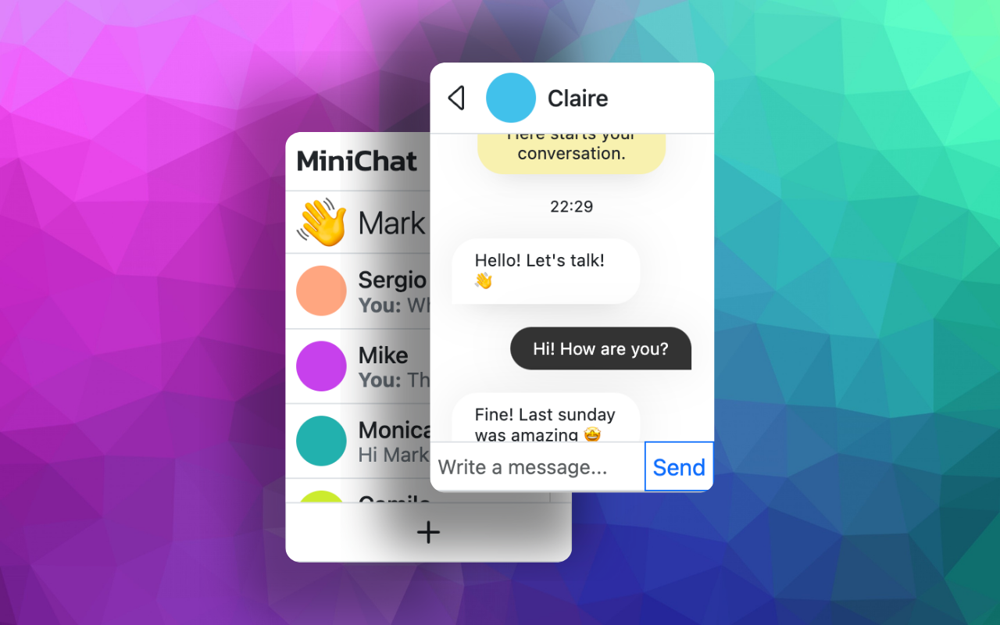

# MiniChat - Chat with friends easily! 💬

MiniChat is a Chrome extension that allows users to easily chat with friends. It provides a simple and intuitive interface for staying connected. The extension periodically checks for new messages and updates the badge icon to indicate unread messages, ensuring users never miss an important conversation. It handles user authentication, chat interface, friend requests, settings, and even sticker management.

## 🚀 Key Features

- **Real-time Notifications**: Get notified of new messages with a badge icon update. 🔔
- **User Authentication**: Securely validate user IDs to protect user data. 🔒
- **Chat Interface**: A clean and user-friendly interface for chatting with friends. 🗣️
- **Friend Requests**: Easily add new friends and manage incoming friend requests. ➕
- **Profile Customization**: Change your profile color to personalize your experience. 🎨
- **Sticker Support**: Express yourself with a variety of fun stickers. 🤩
- **Settings Page**: Manage your account, sign off, and reveal your security key. ⚙️
- **News Feed**: Stay updated with community news and announcements. 📰
- **Spam Prevention**: A mechanism to prevent spamming within the chat. 🛡️

## 🛠️ Tech Stack

- **Frontend**: HTML, CSS, JavaScript
- **Backend**: PHP (API at `https://api.bruno.com.es/minichat/`)
- **Browser Extension API**: Chrome Extension API
- **JavaScript Libraries**:
    - Toastify: For displaying toast notifications.
    - luxon: For date and time manipulation.
- **Data Storage**:
    - Local Storage: For storing user IDs and spam prevention status.
    - Chrome Storage API: For persistent storage of user preferences and data.
- **Other**: JSON (for API responses)

## 📦 Getting Started

### Prerequisites

- Google Chrome browser installed. 🌐

### Installation

1.  Download the repository as a ZIP file.
2.  Extract the ZIP file to a local directory.
3.  Open Google Chrome and navigate to `chrome://extensions/`.
4.  Enable "Developer mode" in the top right corner.
5.  Click "Load unpacked" and select the directory where you extracted the ZIP file.

### Running Locally

Once installed, the extension will appear in your Chrome toolbar. Click the extension icon to open the popup and start chatting! 💬

## 📂 Project Structure

```
MiniChat/
├── html/
│   ├── popup.html          # Main popup HTML
│   ├── create.html         # Account creation page
│   ├── chats.html          # Chat interface (iframe content)
│   ├── sidebar.html        # Sidebar HTML
├── js/
│   ├── background.js     # Background service worker
│   ├── script.js         # Main script for authentication and redirection
│   ├── chats.js          # Chat list and user management logic
│   ├── settings.js       # Settings page functionality
│   ├── stickers.js       # Sticker management
│   ├── sidebar.js        # Sidebar loading and management
│   ├── requests.js       # Friend request handling
│   ├── chat.js           # Core chat functionality
│   ├── register.js       # User registration
│   ├── news.js           # News/announcements display
├── css/
│   ├── style.css           # General styles
├── icons/                # Extension icons
├── manifest.json         # Extension manifest file
```

## 📸 Screenshots



## 🤝 Contributing

Contributions are welcome! Please fork the repository and submit a pull request with your changes.

## 📝 License

This project is open-source and available under the [MIT License](LICENSE).

## 📬 Contact

If you have any questions or suggestions, feel free to contact me at [bruno08rodriguez@gmail.com](mailto:bruno08rodriguez@gmail.com).

## 💖 Thanks

Thanks for checking out MiniChat! We hope you enjoy using it.
